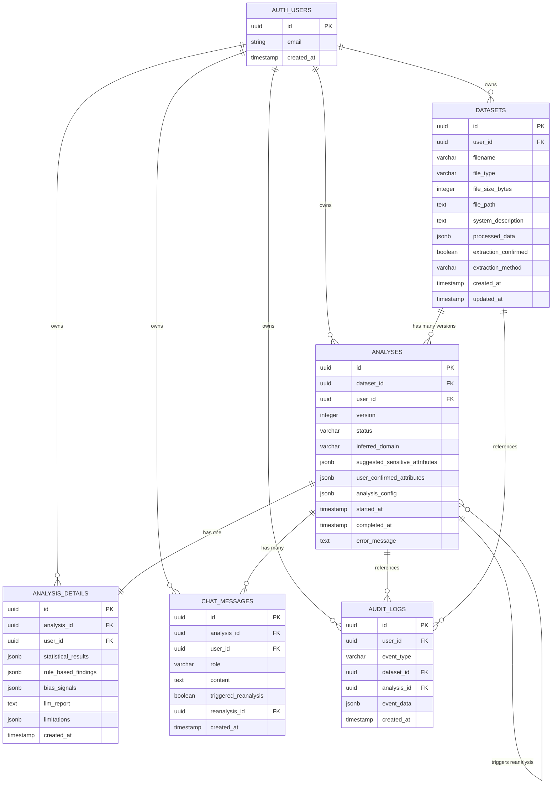
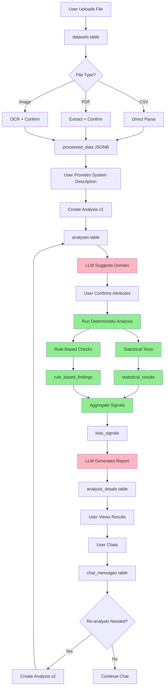
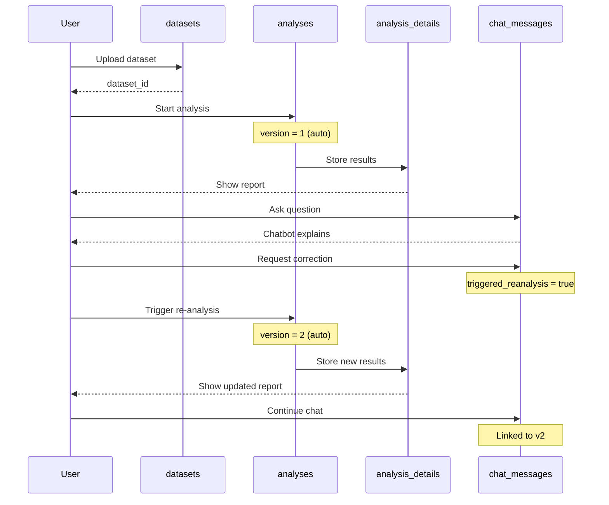
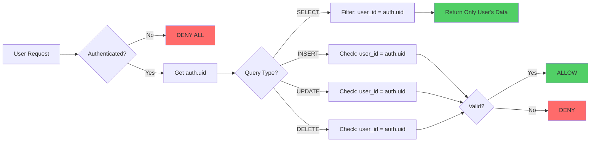

# Database Schema - Visual Diagram

## Entity Relationship Diagram



## Data Flow Diagram



**Legend:**
- 🟢 Green boxes = Deterministic (no LLM)
- 🔴 Pink boxes = LLM (interpretation/explanation only)

## Versioning Flow



## RLS Security Model



## JSONB Structure Examples

### statistical_results

```json
{
  "statistical_parity": {
    "value": 0.15,
    "threshold": 0.1,
    "violated": true,
    "confidence_interval": [0.12, 0.18],
    "groups_compared": ["male", "female"]
  },
  "disparate_impact": {
    "ratio": 0.72,
    "threshold": 0.8,
    "violated": true,
    "four_fifths_rule": "failed"
  },
  "equal_opportunity": {
    "difference": 0.08,
    "threshold": 0.05,
    "violated": true,
    "true_positive_rates": {
      "group_a": 0.85,
      "group_b": 0.77
    }
  }
}
```

### bias_signals

```json
{
  "overall_risk": "high",
  "risk_score": 0.78,
  "detected_biases": [
    {
      "attribute": "gender",
      "severity": "high",
      "metrics_violated": ["statistical_parity", "disparate_impact"]
    },
    {
      "attribute": "age",
      "severity": "medium",
      "metrics_violated": ["equal_opportunity"]
    }
  ],
  "uncertainty_level": "medium",
  "sample_size_adequate": true,
  "data_quality_score": 0.85
}
```

### limitations

```json
[
  "Sample size for age group 65+ is small (n=45), reducing statistical power",
  "Missing data in 'education' column (12% of records) may affect results",
  "Correlation does not imply causation - observed disparities may have legitimate explanations",
  "Analysis assumes binary gender classification - may not capture full diversity",
  "Historical data may not reflect current decision-making processes"
]
```

### processed_data (CSV example)

```json
{
  "columns": [
    {"name": "applicant_id", "type": "string"},
    {"name": "age", "type": "integer"},
    {"name": "gender", "type": "string"},
    {"name": "decision", "type": "boolean"}
  ],
  "row_count": 1500,
  "sample_rows": [
    {"applicant_id": "A001", "age": 32, "gender": "F", "decision": true},
    {"applicant_id": "A002", "age": 45, "gender": "M", "decision": false}
  ],
  "statistics": {
    "age": {"min": 18, "max": 72, "mean": 38.5},
    "gender": {"F": 720, "M": 780},
    "decision": {"true": 890, "false": 610}
  }
}
```

## Table Size Estimates

Assuming 1000 active users:

| Table | Rows per User | Total Rows | Storage per Row | Total Storage |
|-------|---------------|------------|-----------------|---------------|
| datasets | 10 | 10,000 | ~50 KB | ~500 MB |
| analyses | 30 (3 versions × 10 datasets) | 30,000 | ~2 KB | ~60 MB |
| analysis_details | 30 | 30,000 | ~20 KB | ~600 MB |
| chat_messages | 150 (5 msgs × 30 analyses) | 150,000 | ~500 B | ~75 MB |
| audit_logs | 100 | 100,000 | ~1 KB | ~100 MB |

**Total estimated storage**: ~1.3 GB for 1000 users

## Performance Considerations

### Indexes Created

- `datasets`: user_id, created_at
- `analyses`: dataset_id, user_id, status, started_at
- `analysis_details`: analysis_id, user_id
- `chat_messages`: analysis_id, user_id, created_at
- `audit_logs`: user_id, event_type, created_at

### Query Optimization Tips

1. **Always filter by user_id first** (RLS does this automatically)
2. **Use indexes for sorting** (created_at, started_at)
3. **JSONB queries**: Use GIN indexes if needed
   ```sql
   CREATE INDEX idx_statistical_results_gin ON analysis_details USING GIN (statistical_results);
   ```
4. **Pagination**: Use LIMIT/OFFSET with created_at ordering

## Backup and Maintenance

### Recommended Policies

- **Backups**: Daily automated backups (Supabase provides this)
- **Retention**: Keep analysis history for 1 year
- **Archival**: Move old datasets to cold storage after 6 months
- **Cleanup**: Soft delete with `deleted_at` timestamp (optional)

### Cleanup Queries

```sql
-- Find old datasets (>1 year)
SELECT id, filename, created_at 
FROM datasets 
WHERE created_at < NOW() - INTERVAL '1 year'
AND user_id = auth.uid();

-- Archive old analyses
UPDATE analyses 
SET status = 'archived' 
WHERE completed_at < NOW() - INTERVAL '6 months'
AND user_id = auth.uid();
```
